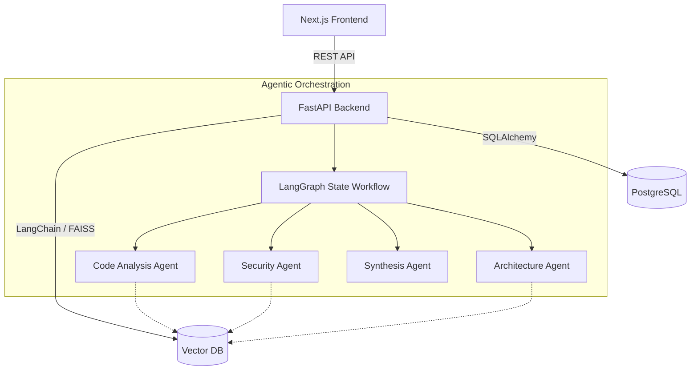

# System Architecture

## Overview
The Autonomous Coding Assistant uses a modern, scalable architecture designed for enterprise-grade AI processing. 

## Multi-Agent Design
The platform uses **LangGraph** to coordinate multiple agents over a shared `GraphState`.
1. **Retrieve Node**: Queries FAISS based on the user's chat input.
2. **Analysis Nodes**: The repository undergoes static structural analysis and LLM-driven logical analysis (e.g., Security, Architecture nodes).
3. **Synthesis Node**: Combines the retrieved RAG context and the reports generated by specialized agents into a final conversational response.

## Database Schema
Relational data is stored in PostgreSQL.
- `users`: Authentication details.
- `repositories`: Project metadata and ingestion status.
- `repository_files`: Raw file content parsed during ingestion.
- `reports`: JSONB storage for structured analysis outputs.

## Deployment Strategy
The system is dockerized using `docker-compose`. 
- **db**: `postgres:15-alpine`
- **backend**: Python 3.11 slim image running `uvicorn`
- **frontend**: Node.js image running Next.js build.
