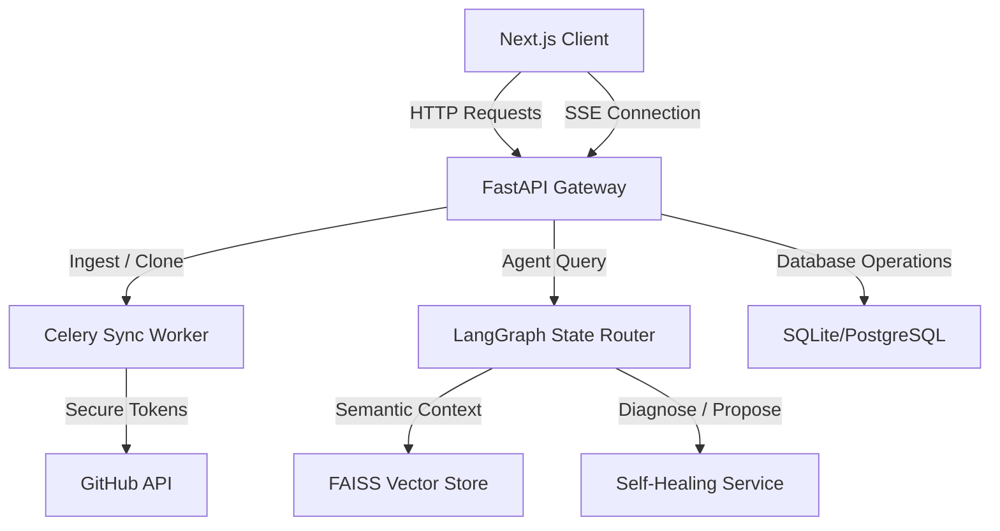

# Tony AI — Multi-Agent Engineering Platform

[]()
[]()
[]()
[]()
[]()

Tony AI is a production-ready, repository-aware AI pair programmer and workflow automation hub. Designed for modern software engineering teams, it provides deep codebase search, automatic PR reviews, diagnostic self-healing monitors, and interactive multi-agent pipelines.

---

## 🚀 Key Features

* **AI Workspace (Repository-Aware Chat)**: Chat, edit, and explore codebases. Uses LangGraph to direct context to specialized agent models.
* **Health Ops & Self-Healing**: Continuously runs synthetic diagnostics across Core APIs, Databases, Redis, and GitHub integrations. Proposes fixes and drafts diagnostic PR branches automatically.
* **Code Explorer & File Resolution**: Full VS Code-style workspace tree with database-backed text content loaders.
* **Pull Request Hub & Automated Reviews**: Analyze and review pull requests instantly. Real-time updates pushed directly to the GitHub API.
* **Visual Automation Center**: Configure and evaluate engineering pipeline workflows (e.g. evaluating PRs, running security audits, or labeling issues).
* **Multi-Agent Orchstration**: Start, Pause, Resume, and Stop specialized agents (Planner, Coder, Architect, Reviewer, Security, Testing, Performance) with live stream logs.

---

## 🛠 Tech Stack

* **Frontend**: Next.js 15, TailwindCSS, React Flow, Lucide Icons, Framer Motion
* **Backend**: FastAPI, Celery, SQLAlchemy, Uvicorn
* **Database & Caching**: PostgreSQL (production), SQLite (local MVP), Redis (queues & results caching)
* **Vector Store**: FAISS, LangChain, OpenAI Embeddings

---

## 📦 Installation & Setup

### Prerequisites

* Python 3.10+
* Node.js 18+
* Redis Server (local or cloud)

### 1. Backend Configuration

1. Navigate to the `backend` directory:
   ```bash
   cd backend
   ```
2. Install Python dependencies:
   ```bash
   pip install -r requirements.txt
   ```
3. Configure your `.env` file:
   ```env
   SECRET_KEY=your-32-char-encryption-key-here
   GITHUB_CLIENT_ID=your-github-oauth-client-id
   GITHUB_CLIENT_SECRET=your-github-oauth-client-secret
   GITHUB_REDIRECT_URI=http://localhost:8000/auth/github/callback
   DATABASE_URL=sqlite:///./antigravity.db
   REDIS_URL=redis://127.0.0.1:6379/0
   OPENAI_API_KEY=your-openai-api-key-here
   ```
4. Start the backend Uvicorn server:
   ```bash
   python -m uvicorn app.main:app --port 8000 --reload
   ```

### 2. Frontend Configuration

1. In the root directory, install npm packages:
   ```bash
   npm install
   ```
2. Configure `.env.local`:
   ```env
   NEXT_PUBLIC_API_URL=http://localhost:8000
   ```
3. Run the Next.js development server:
   ```bash
   npm run dev
   ```
4. Open [http://localhost:3000](http://localhost:3000) in your browser.

---

## 📐 System Architecture



---

## 🤖 AI Agents & Workflows

* **Planner**: Deconstructs user requirements into actionable checklists.
* **Architect**: Determines codebase design patterns and dependency structures.
* **Coder**: Proposes code generation, snippets, and refactoring scripts.
* **Reviewer**: Generates pull request reviews and publishes inline recommendations.
* **Security**: Scans file structures to prevent credential leaks and OWASP issues.

---

## ⚡ Deployment

### Frontend (Vercel)

Set the following environment variables in your Vercel Project Dashboard:
* `NEXT_PUBLIC_API_URL` -> Deployed FastAPI URL (e.g. `https://api.domain.com`)

### Backend (Render)

Deploy as a Web Service running:
* **Start Command**: `python -m uvicorn app.main:app --host 0.0.0.0 --port 10000`
* Add environment variables (`DATABASE_URL`, `REDIS_URL`, `OPENAI_API_KEY`, etc.)

---

## 📄 License

This project is licensed under the MIT License - see the LICENSE file for details.
